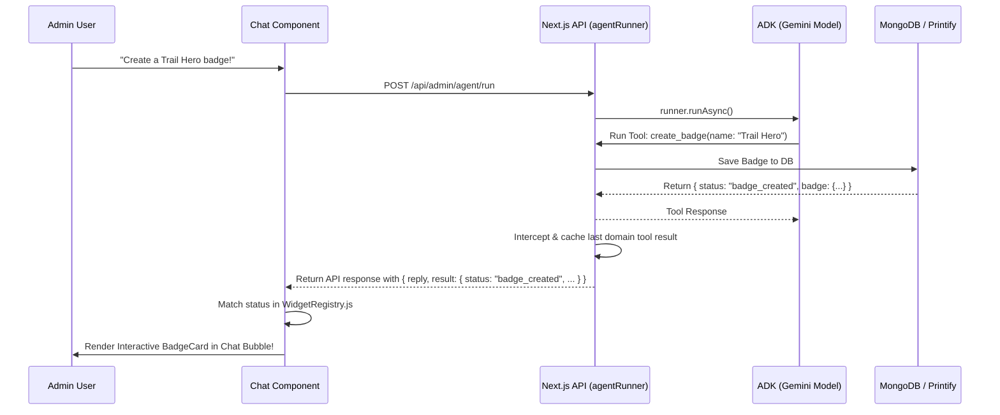

# Beyond Plain Text: How We Render Rich React Cards Directly From AI Agent Tool Calls

Have you ever chatted with an AI assistant that lists out fifteen items in a giant, dry markdown list, only for you to think: *"Man, I wish this was a neat grid of cards with action buttons"*? 

In **Pedal Pals**, we decided that plain text is for the 90s. When our AI admin co-pilot creates a new bike safety quiz, spawns a new cartoon character, or sets up a print-on-demand store listing, the user doesn't get a block of text. They get a beautiful, interactive, action-oriented React card right in the chat feed.

Here is the exact blueprint of how we use **Google's Agent Development Kit (ADK)** tool responses to drive dynamic frontend component rendering.

---

## The Big Picture: How it Works

Instead of trying to parse the LLM's raw conversational text responses (which are unpredictable and fragile), we look at what **actions** the agent successfully executed. 

Whenever the agent calls a tool (like `create_badge`), the tool returns a clean, structured JSON payload. We intercept this result on the server, pass it down in the API response, and use a registry on the client to map the response to a specific React component.



---

## 1. The Backend: Intercepting the Event Stream

On the backend, we run our ADK agents using the `Runner` class. When the runner executes `runner.runAsync()`, it yields a stream of events. We are particularly interested in `functionResponse` events, which contain the output returned by our tools.

But there is a catch: **sub-agent handoffs**. In a multi-agent system, the main coordinator agent transfers control by calling a sub-agent. ADK handles this behind the scenes via internal tools that return loaded `Skill` objects. If we just captured the absolute last tool result, the sub-agent handoff metadata would overwrite our actual database results!

To solve this, we filter out handoff events by comparing tool names against a dynamically compiled set of sub-agent names.

### The Code: `lib/agents/agentRunner.js`

Here is how we capture the final domain-specific tool result:

```javascript
// 1. Gather all sub-agent names from the coordinator tree
function collectAgentNames(agent) {
  const names = [agent.name];
  for (const sub of agent.subAgents || []) {
    names.push(...collectAgentNames(sub));
  }
  return names;
}

// Combine them with general agent transfer functions
const DYNAMIC_AGENT_NAMES = new Set([
  ...collectAgentNames(rootAgent),
  "transfer_to_agent",
]);

export async function runAdminAgent({ message, sessionId }) {
  // ... Initialize ADK Runner ...
  let lastToolResult = null;

  const events = runner.runAsync({ userId, sessionId, newMessage });

  for await (const event of events) {
    // Look for tool response parts in the runner events
    const responses = getFunctionResponses(event);
    for (const resp of responses) {
      if (resp.name !== "adk_request_confirmation") {
        const result = resp.response?.result ?? resp.response;
        const error = resp.response?.error;

        if (!error) {
          // If the tool is NOT a sub-agent handoff, cache the result!
          const isSubagentTransfer = DYNAMIC_AGENT_NAMES.has(resp.name);
          if (!isSubagentTransfer) {
            lastToolResult = result; 
          }
        }
      }
    }
  }

  // Save to database session and return to client
  return {
    reply: "Compiled text reply from model...",
    result: lastToolResult // e.g. { status: "badge_created", badge: { ... } }
  };
}
```

---

## 2. The Frontend: The Widget Registry

Once the API returns the JSON response, the frontend takes over. The chat window iterates through the messages. If a message has a `result` property, it asks the `WidgetRegistry` to resolve it to a React Component.

### The Code: `WidgetRegistry.js`

We maintain a central registry that acts as a lookup table mapping the tool `status` field to dedicated React card components.

```javascript
import BadgeCard from "./cards/BadgeCard";
import CharacterCard from "./cards/CharacterCard";
import QuizCard from "./cards/QuizCard";
import ProductCard from "./cards/ProductCard";
import DefaultResultCard from "./cards/DefaultResultCard";

// Map status strings directly to React Components
export const ResultCardRegistry = {
  character_created: CharacterCard,
  badge_created: BadgeCard,
  quiz_created: QuizCard,
  products_created: ProductCard,
};

export function getCardComponent(result) {
  if (!result) return null;

  // 1. Check for an explicit status match
  if (result.status && ResultCardRegistry[result.status]) {
    return ResultCardRegistry[result.status];
  }

  // 2. Dynamic check for custom structures (e.g., Printify objects)
  const isPrintifyProduct =
    (result.created && Array.isArray(result.created) && result.created.length > 0) ||
    (result.id && result.blueprint_id);

  if (isPrintifyProduct) {
    return ProductCard;
  }

  // 3. Fall back to a pretty JSON viewer card
  return DefaultResultCard;
}
```

---

## 3. The Frontend: Rendering the Card

In our main message rendering component, we call `getCardComponent` inside the message bubble. If a component is returned, we render it inline and inject all the necessary state variables and actions (like duplicate, publish, delete, or click-to-chat).

### The Code: `ChatMessage.js`

```jsx
import { getCardComponent } from "./WidgetRegistry";
import styles from "./AdminAgentWidget.module.css";

export default function ChatMessage({ message, onDuplicateProduct, onSendClick }) {
  const m = message;

  return (
    <div className={styles.chatBubble}>
      {/* 1. Render the text response */}
      <div className={styles.text}>{m.text}</div>

      {/* 2. Dynamically resolve and render the interactive card */}
      {m.result && (() => {
        const CardWidget = getCardComponent(m.result);
        
        return CardWidget ? (
          <div className={styles.cardWrapper}>
            <CardWidget
              result={m.result}
              onDuplicateProduct={onDuplicateProduct}
              onSendClick={onSendClick}
            />
          </div>
        ) : null;
      })()}
    </div>
  );
}
```

---

## Why This Pattern is a Game Changer

1. **Robust Type Safety**: Instead of parsing flaky natural language responses, we rely on Zod-validated tool outputs. If a card is rendered, we know *exactly* what data fields are present.
2. **Infinite UI Extensibility**: Adding a new card is as simple as creating a new React component under `components/admin/AdminAgentWidget/cards/` and adding one line to the registry mapping.
3. **Better UX**: Admins can immediately verify what the AI did, preview the changes, and take quick actions (like editing or duplicating) without having to write more chat prompts.
