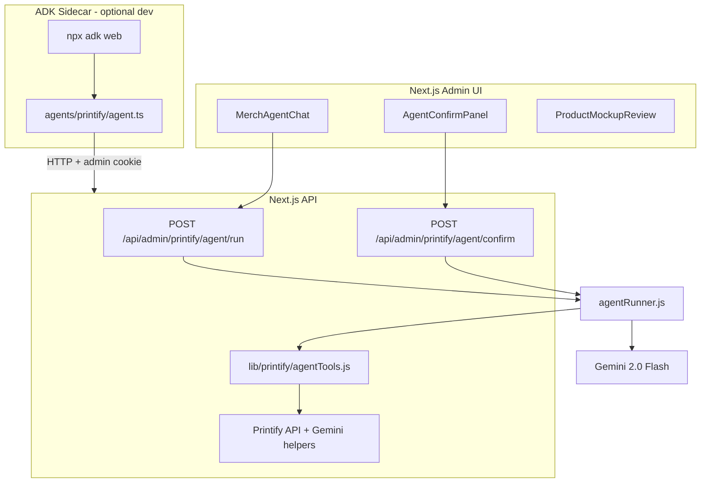

# How We Built the Pedal Pals Printify Merch Agent (with Google ADK)

*Or: teaching a robot squirrel to run a print-on-demand shop without listing “mystery blueprint #48291” on a toddler tee.*

---

## Who this is for

You’re a programmer. Maybe you’ve shipped plenty of CRUD apps and REST APIs. Maybe you’ve pasted prompts into a chat box and thought, “cool, but how do I **put this in my product**?”

This post walks through how we built the **Merch Agent** for [Pedal Pals](https://pedal-pals.com) — an admin tool that turns bike-safety artwork into Printify products (tees, hoodies, stickers, the works). We used **Google’s Agent Development Kit (ADK)** for one deployment shape, and the same **tool contracts** power the agent inside our Next.js app.

If you’re new to **agents** and the **ADK**, you’re in the right place. We’ll use plain language, real file paths, and the occasional dad joke about helmets.

---

## Agents 101 (60-second version)

A **large language model (LLM)** is great at language. An **agent** is what you get when you let the LLM **decide what to do next** and give it **tools** (functions) it can call to touch the real world:

- Search a catalog  
- Read a design from storage  
- Create a product in Printify  
- Ask a human “are you sure?” before spending API quota  

Rough loop:

1. User says something.  
2. Model thinks: “I need data” → calls `search_catalog`.  
3. Your code runs the tool, returns JSON.  
4. Model thinks again → maybe calls `create_products_batch`.  
5. Model replies in English (or calls more tools).

That loop is the whole game. Everything else — ADK, sessions, confirmation UI — is engineering around that loop so it’s **safe**, **debuggable**, and **deployable**.

---

## What is Google ADK?

The **[Agent Development Kit (ADK)](https://google.github.io/adk-docs/)** is Google’s toolkit for building agents in code (Python and TypeScript). Instead of hand-rolling “call Gemini, parse function calls, push results back, repeat,” ADK gives you primitives like:

| ADK concept | What it means |
|-------------|----------------|
| **`LlmAgent`** | An agent with a model, instructions, and a list of tools |
| **`FunctionTool`** | A typed tool the model can invoke (often with **Zod** schemas) |
| **`adk web` / `adk run`** | Dev-time runners to chat with your agent locally |

Think of ADK as **Express for agents**: routing, structure, and conventions so you’re not inventing a new orchestration pattern every Tuesday.

In Pedal Pals, the ADK app lives in a small **sidecar** package:

```text
agents/printify/
  agent.ts      # LlmAgent + FunctionTools
  package.json  # @google/adk, zod, adk-devtools
```

The main Next.js app has a **parallel** implementation (`lib/printify/agentRunner.js`) that runs the same tools via `@google/genai` — so admins get a polished in-app chat without running a second process in production. Same tools, two hosts. More on that later.

---

## The problem we were solving

Pedal Pals admins have **private design artwork** (characters, safety themes) and want **merch** on Printify without clicking through twelve admin screens per product.

They need to:

1. Pick or generate a design  
2. Find the right **blueprint** (tee, hoodie, bodysuit, …)  
3. Pick a valid **print provider** (you cannot guess this — Printify will 404 you into sadness)  
4. Match **colors/sizes** to variants  
5. Create **drafts**, preview **mockups**, then **publish**

That’s a workflow, not a one-shot prompt. Perfect agent territory.


---

## Architecture at a glance



**Key idea:** the **tools** are the contract. ADK tools and in-app tools both call the same Printify/design logic; only the **orchestrator** differs (ADK’s `LlmAgent` vs our hand-rolled Gemini loop).

---

## The ADK sidecar: `agents/printify/agent.ts`

Here’s the heart of the ADK package (simplified for reading):

```typescript
import { FunctionTool, LlmAgent } from "@google/adk";
import { z } from "zod";

const APP_URL = process.env.PRINTIFY_APP_URL || "http://localhost:3020";

async function callApp(path: string, body?: unknown) {
  const res = await fetch(`${APP_URL}${path}`, { /* POST + JSON */ });
  // ...
  return data;
}

const searchCatalog = new FunctionTool({
  name: "search_catalog",
  description: "Search Printify blueprint catalog",
  parameters: z.object({
    query: z.string(),
    limit: z.number().optional(),
  }),
  execute: async ({ query, limit }) => {
    const q = encodeURIComponent(query);
    return callApp(`/api/admin/printify/catalog/blueprints?q=${q}&limit=${limit ?? 20}`);
  },
});

export const rootAgent = new LlmAgent({
  name: "merch_creator_agent",
  model: "gemini-flash-latest",
  description: "Pedal Pals Printify merchandise creation assistant",
  instruction: `You help admins create Pedal Pals bike safety merchandise on Printify...`,
  tools: [listShops, searchCatalog, analyzeDesign, createProductsBatch],
});
```

## The production path: `agentRunner.js` (Gemini + tool loop)

Inside the app, we don’t require ADK at runtime. `lib/printify/agentRunner.js` implements the classic **tool loop** with `@google/genai`:

1. Load or create a **MongoDB session** (`PrintifyAgentSession`).  
2. Append the user message (plus `shopId` / `designId` context).  
3. Call `generateContent` with **function declarations** built from `AGENT_TOOL_DEFINITIONS`.  
4. If the model returns **function calls**, run `executeAgentTool(name, args)` and feed results back.  
5. Repeat until the model returns text or we hit a guard (max 8 iterations).  
6. Special case: if a tool returns `awaiting_confirmation`, **stop** and let the UI handle it.

That’s the same mental model as ADK — just explicit.

### System instructions matter (a lot)

We baked Printify’s sharp edges into the system prompt, for example:

- `search_catalog` returns **blueprint IDs only**.  
- **Never guess `printProviderId`** — call `get_blueprint_details` first.  
- Call `create_products_batch` with **`requireConfirmation: true`** until the human approves.

LLMs love to invent plausible IDs. Printify does not love that back.

---

## Tools: the real API of your agent

Tools are defined in `lib/printify/agentTools.js` and mirrored (subset) in `agents/printify/agent.ts`.

| Tool | What it does |
|------|----------------|
| `list_shops` | Printify shops on the account |
| `search_catalog` | Keyword search over cached blueprints |
| `get_blueprint_details` | Resolves provider + variant data for a blueprint |
| `load_design` | Reads from private design vault |
| `analyze_design` | Gemini vision → title, description, suggested colors |
| `remove_background` | Gemini image edit for apparel-ready PNGs |
| `generate_design` | New art with optional character references |
| `create_products_batch` | Upload art, build variants, create drafts (optional publish) |
| `duplicate_product` / `list_products` | Shop housekeeping |

Each tool is a normal async function. The model only sees **name**, **description**, and **JSON schema** for parameters.


### Example: catalog search returns hints, not traps

`searchCatalog` in `lib/printify/catalog.js` returns entries like:

```javascript
{
  blueprintId: bp.id,
  title: bp.title,
  brand: bp.brand,
  hint: "Call get_blueprint_details with blueprintId only — do not guess printProviderId."
}
```

We’re training the agent *and* the human maintainer.

### Example: human-in-the-loop batch create

`create_products_batch` with `requireConfirmation: true` does **not** create products immediately. It runs `prepareBatchPayload()`:

- Resolves every blueprint/provider pair via Printify’s provider list  
- Fetches blueprint metadata (brand, model, image)  
- Returns `{ status: "awaiting_confirmation", preview: { ... } }`

The React UI (`AgentConfirmPanel` + `ProductReviewSummary`) shows rich cards: brand, provider, colors, sizes, per-product price, checkboxes for what to include.


Only when the admin clicks **Create previews** does the app call:

```http
POST /api/admin/printify/agent/confirm
```

…which runs the same tool with `skipConfirmation: true`, creates **drafts**, polls for **mockups**, and surfaces `ProductMockupReview` for publish / discard / placement tweaks.

Agents that spend money should pause for a human. This is non-negotiable in merch.

---

## Sessions and state

`models/PrintifyAgentSession.js` stores:

- `sessionId` — UUID passed back to the client  
- `shopId`, `designId` — workflow context  
- `messages` — chat history (last 20 turns fed to Gemini)  
- `pendingConfirmation` — batch preview payload  
- `status` — `active` | `awaiting_confirmation` | `completed` | `failed`

Sessions survive page refreshes and make the confirm button idempotent-ish (same payload, same tool).

---

## The admin UI: chat that feels like a product

`MerchAgentChat.js` is a client component that:

- Shows a **preview thumbnail** of the active design in the empty state  
- Streams conversation bubbles (with typing indicator while tools run)  
- Renders `AgentConfirmPanel` when `pendingConfirmation` is set  
- Shows mockup review after drafts exist  
- Navigates to the **Products** tab after publish  

The Create page at `/admin/printify/create` is agent-only — attach designs via vault, upload, drop, or inline AI generate, then chat to build products.


### Previewing, Placement, and Mockups

Once drafts are generated, the admin reviews the mockups to adjust placement and pricing:


After review, clicking publish syncs the products and transitions the admin to the list:


---

## End-to-end flow (what actually happens)

To make it fully concrete, here is what happens when an admin builds merchandise:

1. **Admin selects or generates art** → `designId` in vault.
2. **Admin opens Merch agent, types command** (e.g., *“Unisex tee and kids hoodie in navy and black.”*).
3. **`agent/run` kicks off** → Gemini calls `search_catalog`, then `get_blueprint_details` for each pick.
4. **Gemini calls `create_products_batch`** with `requireConfirmation: true`.
5. **API returns preview** → UI shows **Ready to create previews?** with full product cards.
6. **Admin adjusts price**, unchecks a product, clicks **Create previews (2)**.
7. **`agent/confirm` runs** → drafts created, Printify generates mockups.
8. **Admin tweaks placement, hits Publish** → product goes live.
9. **UI jumps to product list** and the items are visible in the store.

The agent did the boring research; the human did the judgment call. Everyone wins.

---

## Lessons we learned (the hard way)

### 1. Never let the model guess provider IDs

Print providers are per-blueprint. “Provider 5” on a mug is not “Provider 5” on a tee. We added `resolveBlueprintProvider()` and made wrong guesses impossible in `prepareBatchPayload`.

### 2. Cache the catalog

Printify rate limits are real. Blueprints are cached in Mongo for 24 hours (`PrintifyCatalogCache`). Agents are curious; caches keep them from DDoS-ing yourself.

### 3. Two orchestrators, one tool layer

ADK for fast iteration in `adk web`; Gemini loop in Next for production. **Don’t fork business logic** — fork only the runner.

### 4. Confirmation is a feature, not friction

Batch creates without preview led to false “success” messages when every blueprint failed. Now we surface errors and require explicit confirm.

### 5. Placement and mockups are not the LLM’s job

Math for print area (`lib/printify/placement.js`) and polling for mockup URLs are deterministic code. Agents pick products; geometry stays in TypeScript.

---

## File map (cheat sheet)

| Path | Role |
|------|------|
| `agents/printify/agent.ts` | ADK `LlmAgent` + `FunctionTool` definitions |
| `agents/printify/package.json` | `adk web` / `adk run` scripts |
| `lib/printify/agentRunner.js` | In-app Gemini tool loop + confirm path |
| `lib/printify/agentTools.js` | Tool schemas + `executeAgentTool` |
| `app/api/admin/printify/agent/run/route.js` | Chat endpoint |
| `app/api/admin/printify/agent/confirm/route.js` | Human approve endpoint |
| `components/admin/printify/MerchAgentChat.js` | Chat UI |
| `components/admin/printify/AgentConfirmPanel.js` | Pre-preview confirmation |
| `models/PrintifyAgentSession.js` | Session persistence |

---

## Where to go next

- **ADK docs:** [https://google.github.io/adk-docs/](https://google.github.io/adk-docs/)  
- **Add a tool:** define it in `agentTools.js`, wire `executeAgentTool`, add a `FunctionTool` in `agent.ts` if you want ADK parity.  
- **Tighten prompts:** most “agent bugs” are bad instructions, not bad models.  
- **Observe tool calls:** expand the “Tool activity” `<details>` in the panel or log `events` from `agent/run`.

---

## Closing thought

Building an agent isn’t about replacing your backend with magic. It’s about giving a model **bounded superpowers** — search, analyze, propose a batch — and keeping humans in charge of anything that hits an external API with a credit card attached.

We used **Google ADK** to prototype that shape quickly in TypeScript, then wired the same tools into **Pedal Pals** so admins get a friendly chat, a serious confirmation step, and mockups before anything goes live.

Now if you’ll excuse us, we have to explain to Benny the squirrel why he can’t publish a hoodie on blueprint ID `null`.


---

*Built with Gemini, ADK, Printify, and an unreasonable number of bike safety puns.*
