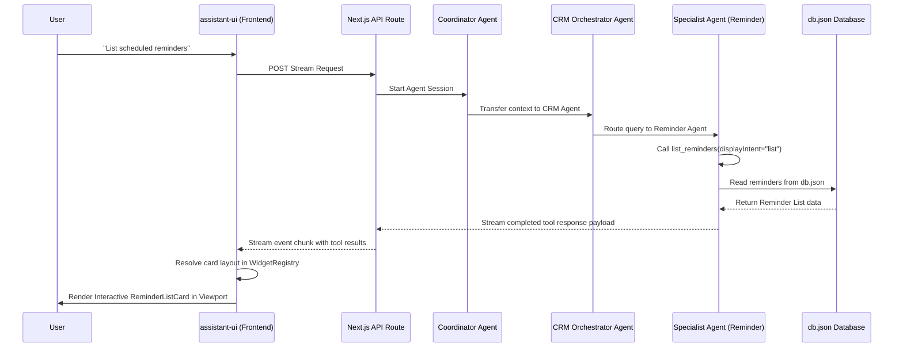

Have you ever chatted with an AI assistant that lists out fifteen items in a giant, dry markdown list, only for you to think: *"Man, I wish this was a neat grid of cards with action buttons"*?

In building our Next.js CRM Chat Assistant, we decided that plain text is not enough. When our AI admin co-pilot searches for client profiles, retrieves company directories, or lists scheduled reminders, the user doesn't get a block of text. They get a beautiful, interactive, action-oriented React card right in the chat feed.

Here is the architectural blueprint of how we use Google's Agent Development Kit (ADK) tool responses to drive dynamic frontend component rendering, without coupling our database operations to visual styling.

---

## High-Level Architecture Overview

The CRM Assistant utilizes a **hybrid backend/frontend agentic architecture** to achieve real-time, responsive conversations with visual components. The stack leverages:
- **Google Agent Development Kit (ADK)**: For orchestrating autonomous sub-agents, planning tool usage, and managing conversation state.
- **assistant-ui**: A headless React chat framework configured for streaming, message parts processing, and Generative UI rendering.
- **Local JSON Database**: An in-memory/filesystem database for storing client profiles, company information, and scheduled reminders.
- **Framer Motion & Vanilla CSS**: For HSL violet-ambient glassmorphic design and subtle micro-interactions.

---

## Backend Architecture: Multi-Agent Orchestrator & Specialist Sub-Agents

The backend agent layer consists of a hierarchical **Coordinator-Orchestrator-Specialist** design. 

### 1. The Coordinator Agent
The root coordinator agent receives the raw user request. It acts as the gateway and router, determining if a query requires CRM assistance and transferring execution to the CRM Orchestrator sub-agent.

### 2. The CRM Orchestrator Agent
The CRM Orchestrator agent acts as the coordinator's deputy for database operations. Instead of performing database reads and writes directly, it maintains a suite of specialist child agents and routes requests appropriately depending on whether the user asks about clients, companies, or reminders.

### 3. Specialist Sub-Agents
Specialist agents—such as the Client Agent, Company Agent, and Reminder Agent—hold highly focused system instructions and have access to specific database tools. These agents are decoupled from the presentation logic and from each other, focusing entirely on their functional domains.

---

## Database Layer

The data backend is powered by a local filesystem database. It defines structured schemas for:
- **Clients**: Representing client profiles (names, contact info, statuses, and notes).
- **Companies**: Storing business entities (name, industry, website, notes).
- **Reminders**: Tracking scheduled tasks associated with clients or companies (due date, task description, completion state).

Helper functions handle reads and writes against the database, ensuring that updates are instantly serialized to disk.

---

## Decoupled Generative UI & Intent-Driven Component Resolution

The cornerstone design principle of this application is the **strict decoupling of the data layer from the presentation layer**. 

### How Tools Expose Presentation Intent
Rather than returning specific React component names from backend tools, our database tools remain presentation-agnostic. Tools accept a presentation intent parameter through their validation schema. 

The LLM determines the user's intent based on the prompt, decides on the presentation intent, and passes it to the tool execution block:
- **Profile Overview**: Used when the user requests a deep-dive card for a single item.
- **List**: Used when displaying a collection of items.
- **Silent Mode**: A boolean option allowing the agent to perform background actions or conversational-only answers without rendering a visual card.

### The Component Resolver
On the frontend, a central registry acts as a dynamic router. It inspects the tool call's datatype and presentation intent, matching them to the appropriate React card:
- A search that yields a single client resolves to the detailed Client Card.
- A search yielding multiple clients resolves to the Client List Card.
- Similar resolution logic applies to Companies and Reminders.

If the silent flag is enabled or an error is encountered, the registry handles it gracefully by returning `null` or displaying a fallback error status card.

---

## Frontend UI Setup & Assistant Runtimes

The user-facing chat client is built using headless primitives designed for chat-based interactions.

### Page Setup and Auto-Scrolling Viewport
The viewport automatically tracks dynamic layout adjustments. When a card expands, collapses, or is added to the list, the viewport updates its scroll position, keeping the user pinned to the bottom of the conversation window.

### Rendering Assistant Message Parts
The assistant message component parses incoming message parts. Text parts are rendered as conversational bubbles, while tool-call parts are directed to a custom tool renderer. Once a tool execution completes, the tool renderer resolves the widget dynamically and injects the returned properties directly into the visual component.

---

## Interactive Database Updating (Status & Completion Cycling)

Visual cards in the chat feed are not static mockups; they are functional mini-dashboards that support inline updates, such as toggling a reminder checklist or cycling a client's status.

### The Unified PATCH Handler
The application exposes a single API PATCH handler. When interactive buttons on cards are clicked, they trigger background HTTP requests containing the item ID and the updated properties.

### Optimistic UI Cycling
To keep the experience fast and responsive, the visual cards implement optimistic updates. Clicking a reminder's checkbox immediately toggles its checkmark status in the React state. The component simultaneously dispatches a PATCH request to the server. If the network request fails, the UI gracefully rolls back to its original state, ensuring that the frontend remains consistent with the database.

---

## Dynamic Data Flow Walkthrough

When a user submits a query like *"List scheduled reminders"*, the following workflow occurs:

1. **Composer Submission**: The user submits input in the chat composer.
2. **ADK Stream Start**: The runtime sends the input to the ADK API endpoint.
3. **Multi-Agent Routing**: The Coordinator agent analyzes the prompt and transfers execution to the CRM Orchestrator, which delegates it to the Reminder Agent.
4. **Tool Execution**: The Reminder Agent executes the reminder listing tool, specifying the list presentation intent.
5. **Data Retrieval**: The tool reads matching tasks from the local JSON database.
6. **Conversational Synthesis**: The agent synthesizes a short confirmation message, transmitting it along with the tool results.
7. **Frontend Card Rendering**: The client intercepts the tool result. The resolver identifies the datatype as reminders and the intent as a list, rendering the Reminder List Card in the viewport.
8. **Interactive Update**: If the user checks off a task on the rendered card, the component optimistically updates the checkbox and performs a PATCH request to persist the completion state.
9. **Auto-Scroll Adjustment**: The viewport adjusts scroll positions automatically as visual layouts animate into view.

---

## Why This Pattern is a Game Changer

1. **Robust Type Safety**: Instead of parsing flaky natural language responses, we rely on structured tool outputs. If a card is rendered, we know *exactly* what data fields are present.
2. **Infinite UI Extensibility**: Adding a new card is as simple as creating a new React component and mapping it to a presentation intent in the registry.
3. **Better UX**: Admins can immediately verify what the AI did, preview the changes, and take quick actions (like editing or duplicating) without having to write more chat prompts.

By intercepting your agent's event stream and routing tool results through a client-side component registry, you can turn plain text chat streams into interactive, actionable dashboards that feel like true software products.
